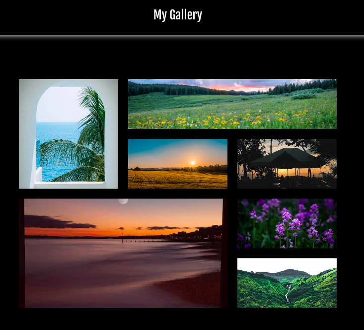
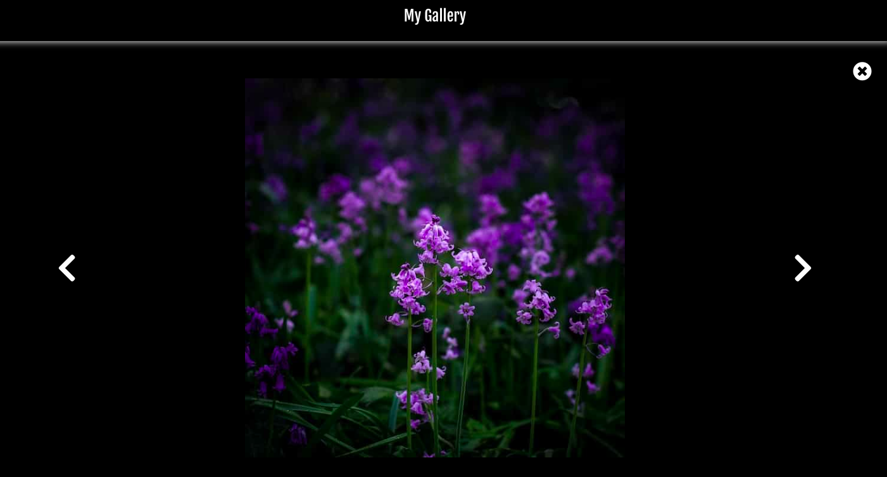

# Projet My Gallery

## Objectif du projet

Ce projet permet la manipulation d'images grâce à une lightbox, une fenêtre de navigation.
Cette lightbox est accessible grâce au clic de la souris et également par le clavier, avec les flèches <- / -> et les touches Entrée et Esc.

  
